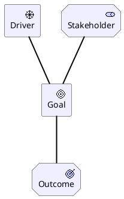

# TOGAF
## What it is and what it doesn't
- TOGAF is an enterprise architecture framework, so if u want something to create a system or develop a project u should apply any other FW(Evolutionary Architecture or Rozansky&Woods)
- TOGAF is about waterfall(they try to go to agile in 10th edition, but it's still waterfall). If u need an agile, try other FW(LEAF/The Open Group Agile Arch Framework)
- TOGAF is about whole enterprise, not only IT, so u should be able to make a change in business and strategic views also
- TOGAF is about Change, so if you want provide to some routine procedure, you should use other frameworks (ITIL)

## Structure

TOGAF has 10 phases:
- preliminary
- A. Arch Vision
- B. Business
- C. Information Systems
- D. Technology
- E. Oportunities and Solution
- F. Migration Planning
- G. governance
- H. change management
- requirements management

Actually, phase H turns to phase A, so you can move iteration by iteration, but actually every iteration is quite long

### preliminary

Here you should obtain arch work request (what u will do and why), estimate organisation change assessment(can u do this, is organisation mature to change) and also adapt TOGAF. The main goal -- find and estimate resources. May be all requested architecture activity is formal and unnecessary.

### A. Arch Vision

Identify stakeholders and develop a helicopter view of all activity and discuss with stakeholders. Also here should be defined motivation layer(goals, drivers, etc) and risc management activities. 

Main entities here is 
- **stakeholder**, who drives/sponsor/participate transformation
- **driver**, which drives goals
- **goals**, which should be reached. Better be set up as SMART
- **outcome**, some consequences of goals

when u identify stakeholders you should start to govern them. First start with table
| stakeholder | contacts | is interested in | is important | strategy |
| ------------| ---------|------------------|--------------|----------|
| Vasya (CTO) | +7 901...| nope             | yep          | should be engaged |

Also here should be identified some risks

| risk | current level | reaction strategy | target level |
| ---- | ------------- | ------------------- | ------------ |
| meteor | high        | mitigation. Develop cosmic antimeteor laser canon | low |

### B. Business

Develop a current and target business and strategy arch (value streams, capabilities, processes, roles, org.structure)

the key elements here are
- value stream -- supply chain of value delivery
- capability

### C. Information Systems

Develop a current and target arch of applications and data (applications, application services, data objects and interfaces)

### D. Technology

Develop a current and target arch of hardvare and platform/infrastructure software(nodes, tech interfaces)

### E. Oportunities and Solution

Here u should make a core descisions how to implement change (will you bought vendor software or develop in-house, so on)

### F. Migration Planning

Here you should develop roadmap and manage riscs

### G. governance

Here you should control change process

### H. change management

Here you should implement some changes, incoming during realisation (adapt)

### requirements management

Thru whole process you should be able to work with requirements