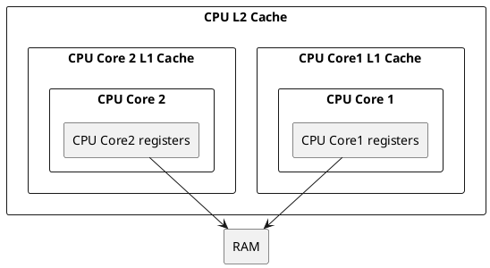
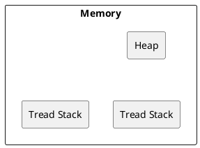

# Java Memory Model

JVM has it's own memor model different to common hardware architecture. For example here is common hardware memory model with CPU registries, caches and RAM and JMM:



on the opposite JVM tries to unify all architectures by common memory model



Whole JVM process has only one heap and every thread has it's own stack.
All primitive types instances(except object members), method arguments and local variables references stored on thread stack. All reference types values and primitive types object analogs stored on heap

### Reordering and concurrency problem

As far as JVM can reorder instructions result may be frustrating in the case of concurrent execution.

JMV implements `happens-before` guarantee which means that semantics before and after reordering should not change, but it's quite difficult to provide such guarantee for concurrent program.

For example:
```Java
public class Counter{
  public static Counter getInstance(){
    if(_this == null) return _this = new Counter();
    return _this;    
  }

  private static Counter _this; 

  private int counter = 42;

  public int getCounter(){
    return counter;
  }

  public void bar(){
    counter++;
  }
}
```

if `bar` will be called from multiple threads then it's possible to get confusing results in the counter because

+ ++ is not atomic, so when one thread reads counter other can modify it(you should use syncronization to avoid this)
+  there is a gap between sync memory and cpu caches, so when one thread modify counter other can obtain old value because it was not still flushed to memory(you should use volatile to avoid this)
+  really initialization and acquisition are separate process and could be reordered by JVM if it decides that it will improve performance. So, to avoid such reordering you can use `volatile` keyword too.

