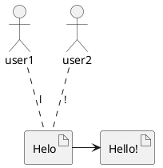

# Conflict-free Replicated Data Types

Conflict-free Replicated Data Types(CRDT) used in design of collaborative application when many users collaboratively edits one document(like Google docs)
CRDT is quite new algorithm which replace Operation Transformation(OT) algorithm, main cons of OT was central server(sequencer) nessesity. CRDT on the other hand provide an ability of communication between end-users.

Main idea of CRDT is convergence guarantee:  
`Any two nodes which have seen the same operations set(may be in different order) should provide the same state`  
In operation-based CRDTs the convergence property is implemented
by ensuring that concurrent operations commute

The simpliest CRDT can be implemented as set of tuples with kind `(item_id, node_id, value)` so if we have a collaborative text editor with a scheme



Than our CRDT may be as following
```
{0.2, A, "H"}
{0.4, A, "e"}
{0.6, A, "l"}
{0.8, A, "o"}
{0.7, A, "l"}
{0.9, B, "!"}
```
where first column is an `item_id` and has value between 0 and 1 and second column is `node_id` and has value A for user1 and B for user2

