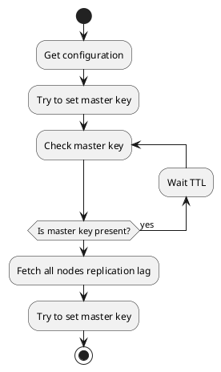

# DBMS Failover algorithm

Here I describe autofailover algorithm for master-slave replication based on some distributed metadata storage(for example etcd). This is quite similar to [patroni](https://github.com/zalando/patroni) workscheme

Let's say we have single master configuration with multiple slaves. In case of failover we should promote one of slaves to master, but also we should avoid multiple master election and provide strong concesus in this case.

+ All nodes connect to metastore and fetch configuration with TTL
+ All nodes tries to promote themselves by atomicaly set `master` key in metastore
+ One node which set master key successfuly become master other become slaves
+ Each TTL seconds master update master key
+ If TTL wasn't updated by master than new master elected
+ All nodes fetch other nodes replication lag. If current node has smallest lag than it try to promote itself

Quite different approach using in Kafka. There are setting `unclean.leader.election.enable` that (if set to false) prevent replicas that are not in-sync to participate in elections

