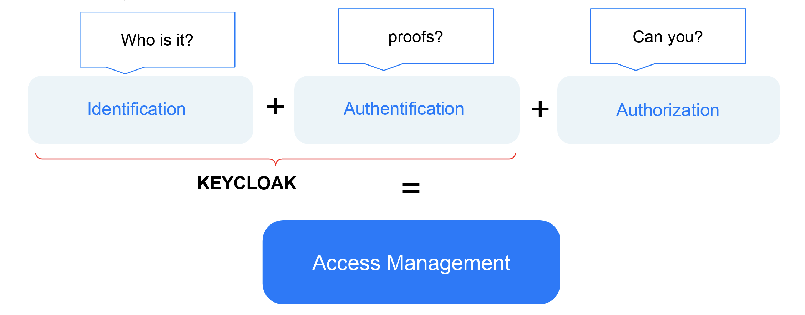

# Enterprise Authentication. Part 1. Basics
Since working with a lot of different software development and engeneering teams I noticed that a lot of my collegues are not clearly understood all shades of contemporary authentication protocols, moreover frequently confuse authentication with authorization and identification. In this articles I will try to explain what is authentication, how it works based on most popular protocols and how to implement this protocols using [Keycloak](https://www.keycloak.org/)

Here is the articles list:
- Enterprise Authentication. Part 1. Basics (here you are)
- [Enterprise Authentication. Part 2. LDAP](./auth-ldap.md)
- [Enterprise Authentication. Part 3. Kerberos](./auth-kerberos.md)
- [Enterprise Authentication. Part 4. SAML](./auth-saml.md)
- [Enterprise Authentication. Part 5. OIDC](./auth-oidc.md)

## What is authentication (and what it isn't)
First of all we should see the difference between 3 concepts: authentication(authN), identification and authorization(authZ):

- Identification is responsible for recognition a person in front of us (Who is it?). It should be anything from simple login form up to QR codes from already logined device or every face recognition
- Authentication is responsible for verification of identification procedure. Also a lot of options possible here: password, confirmation codes by SMS/email/etc, one-time-password apps like Google Authenticator, etc. The main idea is to take some proof that person in front of us is exactly the same who he want to appear
- Authorization is the final step of access management process. It's responsible for confirmation of person's permissions for some actions which persons want to do. Basically it's can be some kind of dialogue with some "arbiter" like "Can I? No/Yes". Here also can be a lot of realisation options, but I belive that authorization is a subject for a separate article cycle (or may be even a RFC like 6749, which we will briefly touch in article about [OIDC](./auth-oidc.md))

A Keycloak which I introduced before and which we will use for all our study cases is an open source identity and access management (IAM) software. It's used for manipulating user's identities(for identification), and as central authentication system

> Actually Keycloak also could be used for authorization purposes, but it's not point of our interests now (however we see a few options in SAML and OIDC chapters)

## Why so serious? 
Looks that we can simply use login + password? Unfortunatelly we can't. First of all, we don't want to. Actually average person use a lot of systems in their life, and every has it's own password (or, even worse, the same). Just imagen all  this passwords you should to remember...  Of course, there are some password management systems like Bitwarden, but all of them also have some exploites and all your passwords one day could be stolen. Moreover you could be accessible to some sensitive data (nuclear bomb codes). Are you really want to save password from nuclear button on the Bitwarden/paper or even forgot it? If you belive Hollywood films, they are not use passwords, they use a physical keys/or retina scaner or something more complicated, and actualy, our large enterprises(Critical Informaion Infrastructure/CII) also use more complicated and secured authentication system. On the other hand large enterprise has a lot of systems, and if each of them will use it's own IAM it will be a real chaos every time when new employee gets a job, or someone get fired. Administrators should add or delete new user from every system. So the last our concern will be the one unified IAM, to rule all systems. So, what we should do?

## SSO

So, we have a few concerns:
- we want to have one password per employee, or don't have at all
- we want to be able to use physical keys instead of passwords
- we want to operate all identities and permissions in one system

To meet them all let me introduce an Single Sign On (SSO) technique. The main idea is that we have one authentication system which one all our enterprise system trust. If we have one access control system we can connect it to one single identities database and also can apply any security measures we need. In later chapters we will meet a different realisations of such authN system and different SSO protocols.

## Keycloak

For all experiments I will use [this](https://github.com/ondator/sandboxes) docker compose scripts (please don't use them in production). To run them up just clone repository, add record `127.0.0.1       keycloak` to your /etc/host and run

```
docker compose -f keycloak-postgres.yml up
```

this script will set up a few docker containers and in a few minutes you can go to http://keycloak:8080 and see Keycloak admin panel. Default login and password are admin:Pa55w0rd