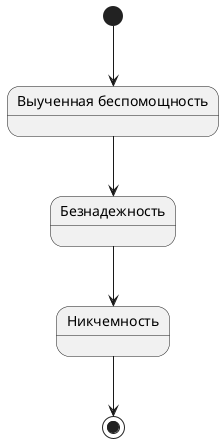

# Жесткие переговоры
Это краткий пересказ из книжки "Жесткие переговоры. Кремлевский формат" М.Пелехатого

## Выученная беспомощность
Выученная беспомощность -- ключ к успешной манипуляции

Выученная беспомощность -- состояние бессилия и аппатии, в которое был целенаправленно погружен человек злоумышенником для достижения своих целей. Достичь его можно:
1. выдавая всегда негативную обратную связь (ругать и за хорошее и за плохое)
2. выдавая рандомную обратную связь (за одни и те же поступки иногда ругаем иногда хвалим иногда игнорим) или всегда игнорим
3. выказывать явное безразличие

Далее можно перевести оппонента к безнадежности и никчемности
- безнадежность -- есть цель, но достичь невозможно
- никчемность -- есть цель, но я недостоин

## Как выучить беспомощности
Ввергнуть человека в состояние выученной беспомощности можно и довольно быстро используя определенные техники:
- негативная оценка или даже оскорбления -- бросить что-то типа "серьезно?! Это просто смешно" или "класс, ну а если серьезно <своя точка зрения>" ну или прямые или скрытые оскорбления
- свернутый диалог -- постоянно орать чаечкой "я вообще не понимаю что тут происходит" "давай быстрее уже" "все?!" "и что?!"
- хороший-плохой полицейский
- атака статусом и количеством -- привести с собой 100500 Миллеров и директоров по НИИХУЯ
- интерпретировать в свою пользу -- "ваше предложение никак не приблежает нас к конценсусу!", "вы по-прежнему трактуете все в свою пользу" и т.п.
- полуролевое воздействие -- "ну а кто должен решать, если не ты?!" "дак вот у нас целый ты для этого есть" "а ты тогда зачем?!" и т.д. В бытовых ситуациях это манипуляции типа "тыж мужчина" "тыж программист" и т.д.

ну или совсем хардкор:
- ограничение свободы и/или коммуникации
- атака на личное пространство

## Атака статусом
Идея в том, что бы всеми силами казаться больше чем ты есть. Если не повезло и общаетесь лично, то либо сидим с прямой спиной, или даже опираемся на стол с небольшим наклоном вперед (нависаем над жертвой), либо растекаемся в кресле, что бы показать кто тут папа. Если котим занять сильную позицию, то надо постоянно смотреть в глаза (если хотим по-доброму, то не более 40% времени). Не показываем невроза, умеем себя держать
Можно начать ходить по помещению, что-то трогать и смотреть. Можно передвинуть стул, что бы занять более удобную позицию по отношению к оппоненту (если хотим сраться, то садимся напротив, если дружить, то рядом)
## Место силы
Если пресуют нас, то важно
- понять, что поплыли (чувствуем стресс, мысли скачут, чувство беспомощности и т.д.)
- постараться не показывать виду
- откинуться на спинку стула и представить что мы в "месте силы", при этом постараться вспомнить запах/вкус/звук оттуда. Место силы, естественно, надо выбрать заранее и потренироваться туда "перемещаться"
- если совсем пиздец, то молча рвем коммуникацию (мне это не интересно/мое время на вас закончилось и т.п.). Лучше выйти и войти нормально чем подписаться под говном